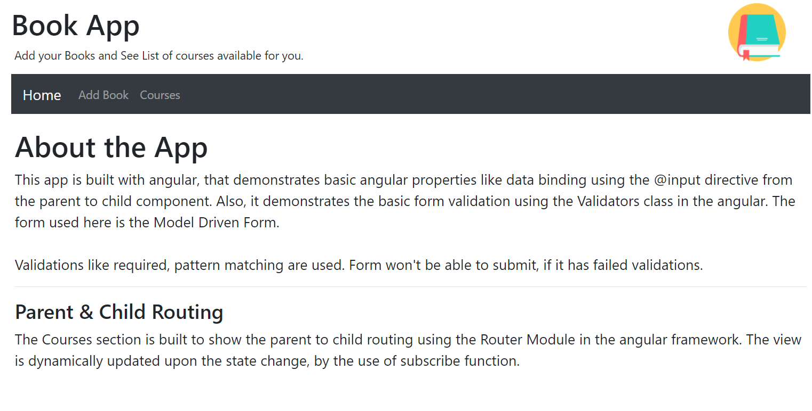
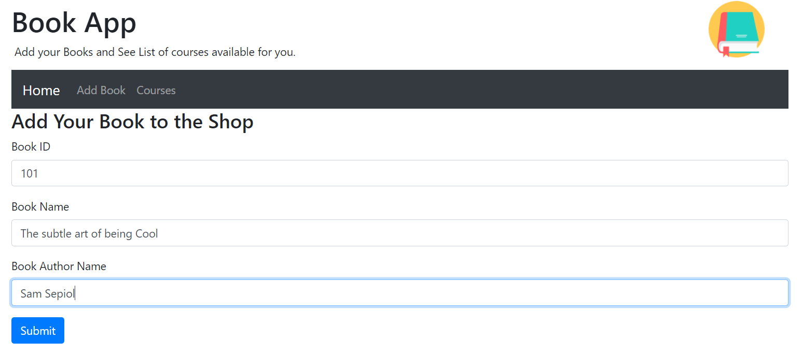
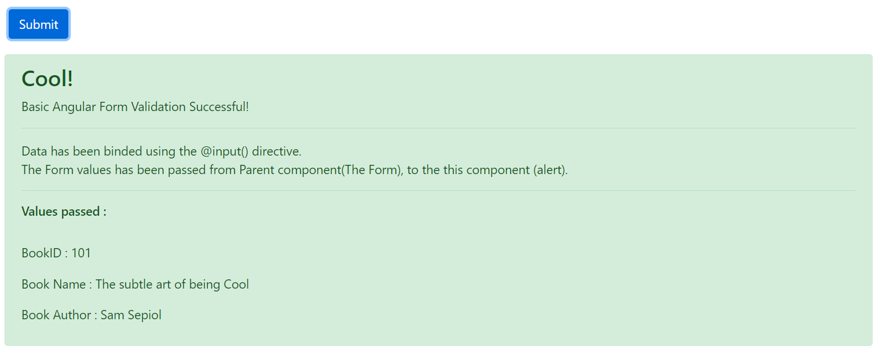
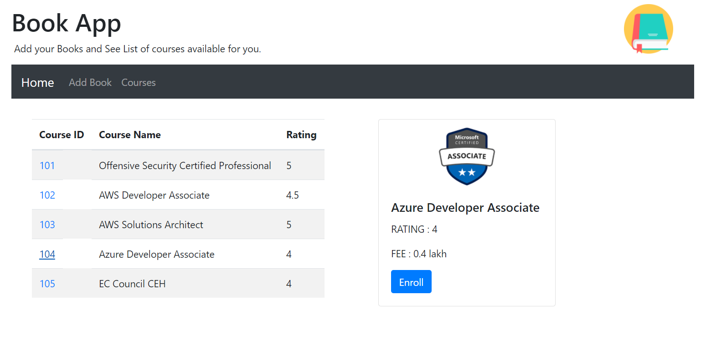

# Angular Frontend Book App
A Book Application that is built with angular, that demonstrates basic angular properties like data binding using the @input directive from the parent to child component. Also, it demonstrates the basic form validation using the Validators class in the angular. The form used here is the Model Driven Form.

Validations like required, pattern matching are used. Form won't be able to submit, if it has failed validations.

## Parent & Child Routing
The Courses section is built to show the parent to child routing using the Router Module in the angular framework. The view is dynamically updated upon the state change, by the use of subscribe function.

## Welcome Page

## Add Book Page
This page has some form input elements that are part of the Model Driven Form. Some of the basic validations are done and form cannot be submitted if it has errors.

## Data binding using @Input() directive
Data has been binded using the @Input directive, from the parent to the child component.

## Courses Page
In this page, we can see the parent and child routing using the RouterModule. The courses can be navigated through their respected courseIDs. We can see some of the patterns demonstrated in this application in the real world too.

